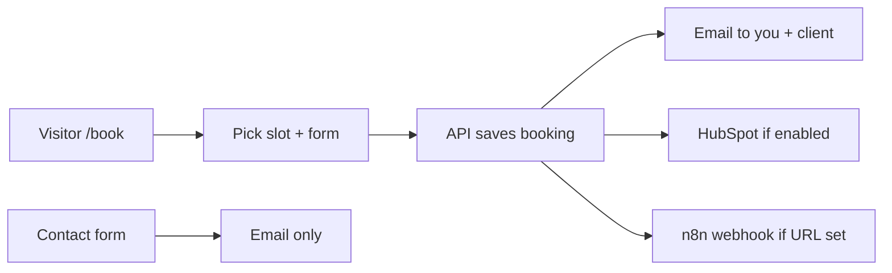
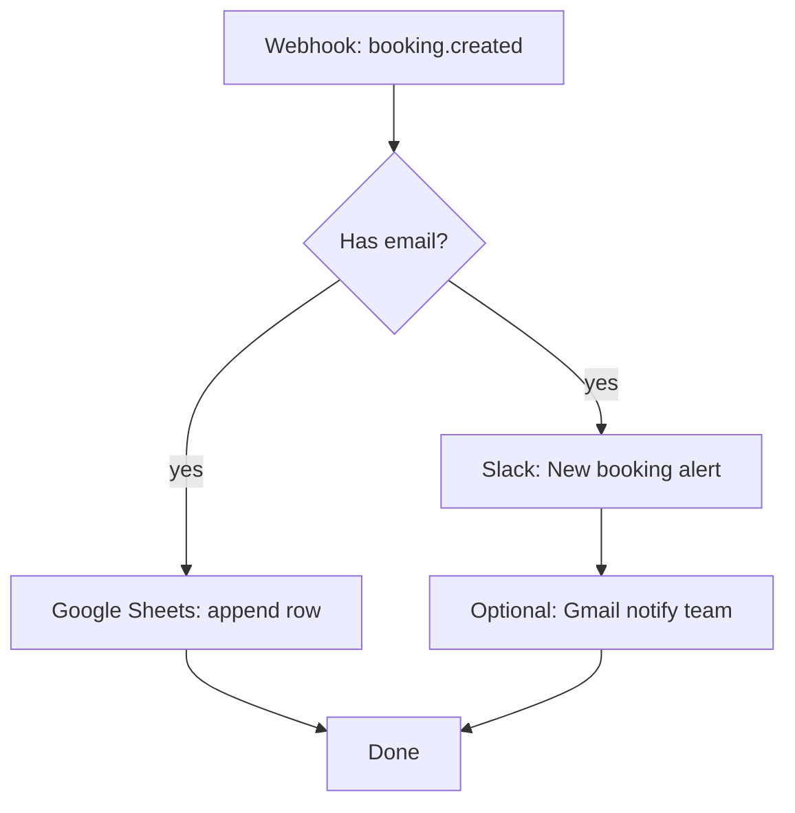

# Complete funnel setup guide

**Muteeb Labs portfolio** — discovery-call booking, email, HubSpot CRM, n8n automation, and admin stats.

Use this as your **single checklist**. Secrets go only in **`.env`** at the project root (same file Docker uses). Never commit `.env` to Git.

Related files:

- [SETUP_CREDENTIALS.md](./SETUP_CREDENTIALS.md) — short credential reference  
- [SALES_FUNNEL.md](./SALES_FUNNEL.md) — how the product flow works technically  

---

## What runs automatically today



| Step | Happens when | Needs config |
|------|----------------|--------------|
| Show open slots | Always (API running) | `backend/data/availability.json` |
| Save booking | User confirms on `/book` | API running |
| Confirmation emails | After booking | `EMAIL_*` + `MEETING_LINK` |
| HubSpot contact + deal | After booking | `HUBSPOT_ENABLED` + token |
| n8n automation | After booking | `N8N_BOOKING_WEBHOOK_URL` |
| Admin stats API | You call URL manually | `BOOKING_ADMIN_KEY` |
| Cancel booking + free slot | Client uses link in email or `/book/cancel?token=…` | `PUBLIC_SITE_URL` (correct domain in cancel links) |

### One client per time slot (no double-booking)

- Confirmed bookings are stored in SQLite with **transactional overlap checks** — two people cannot book the same start time.
- The **slots API** only returns times that are still free (confirmed bookings block the range).
- If two visitors pick the same time, the **first** confirmation wins; the second gets **409** with “slot no longer available” on the website.
- **Cancellation** sets `status = cancelled`, which removes the block so the slot appears again for others.
- Confirmation emails include a **cancel link** (`PUBLIC_SITE_URL/book/cancel?token=…`). The booking page explains one booking per slot and greys out fully booked days.

API endpoints (for reference):

| Method | Path | Purpose |
|--------|------|---------|
| `GET` | `/booking/slots` | Open times only |
| `GET` | `/booking/availability-summary` | Open slot count per day (UI) |
| `POST` | `/booking/` | Create booking |
| `POST` | `/booking/cancel` | Cancel by `token` (from email) or `booking_id` + `email` |
| `GET` | `/booking/manage?token=` | Preview before cancel |

---

## Part 1 — Required credentials (minimum to go live)

Add these to **`.env`** in `/home/muteeb/muteeb_portfolio/.env`:

### 1. Email (contact form + booking confirmations)

| Variable | Example | How to get it |
|----------|---------|----------------|
| `EMAIL_USER` | `muteebworkinfo@gmail.com` | Your Gmail account |
| `EMAIL_PASS` | 16-char app password | [Google App Passwords](https://myaccount.google.com/apppasswords) (2FA required) |
| `EMAIL_FROM` | `business@muteeblabs.uk` | Gmail → Settings → **Send mail as** (verify alias) |
| `EMAIL_TO` | `business@muteeblabs.uk` | Inbox for leads and bookings |
| `EMAIL_HOST` | `smtp.gmail.com` | Fixed |
| `EMAIL_PORT` | `587` | Fixed |
| `EMAIL_USE_TLS` | `True` | Fixed |

### 2. Meeting link (Zoom or Google Meet)

| Variable | Example | How to get it |
|----------|---------|----------------|
| `MEETING_LINK` | `https://zoom.us/j/1234567890` | Zoom → **Personal Meeting Room** → copy link |

or

| `MEETING_LINK` | `https://meet.google.com/xxx-xxxx-xxx` | Google Calendar → appointment schedule or recurring Meet link |

Without `MEETING_LINK`, the client still gets an email but the “Join meeting” link falls back to your contact page.

### 3. Your availability (no password — edit JSON)

File: **`backend/data/availability.json`**

- `weekly_hours` — e.g. Mon–Fri 10:00–18:00  
- `blocked_dates` — holidays `["2026-12-25"]`  
- `min_notice_hours` — e.g. `24` (no same-day booking)  

Optional in `.env`:

```env
BOOKING_TIMEZONE=Asia/Karachi
BOOKING_DURATION_MINUTES=30
```

### Minimum `.env` block (copy-paste template)

```env
# === REQUIRED ===
EMAIL_HOST=smtp.gmail.com
EMAIL_PORT=587
EMAIL_USE_TLS=True
EMAIL_USER=muteebworkinfo@gmail.com
EMAIL_PASS=paste-your-gmail-app-password-here
EMAIL_FROM=business@muteeblabs.uk
EMAIL_TO=business@muteeblabs.uk
MEETING_LINK=https://zoom.us/j/YOUR_PERSONAL_ROOM_ID
BOOKING_TIMEZONE=Asia/Karachi
```

Restart API after changing `.env`:

```bash
cd backend && python main.py
```

---

## Part 2 — HubSpot CRM setup (optional, free)

The **website API** can create HubSpot records automatically. You do **not** need n8n for basic CRM if this is enabled.

### What the site creates on each booking

1. **Contact** — name, email, company, phone; lifecycle = lead  
2. **Deal** — title like `Discovery call — John Doe`, stage = meeting scheduled  
3. **Association** — deal linked to contact  

### Step-by-step in HubSpot

1. Create a free account: [hubspot.com](https://www.hubspot.com/)  
2. **Settings** (gear) → **Integrations** → **Private Apps** → **Create a private app**  
3. Name it e.g. `Muteeb Labs Website`  
4. **Scopes** tab — enable:
   - `crm.objects.contacts.read`
   - `crm.objects.contacts.write`
   - `crm.objects.deals.read`
   - `crm.objects.deals.write`
5. **Create app** → copy the **Access token** (starts with `pat-`)  
6. In HubSpot go to **CRM → Deals** → open your pipeline → **Edit pipeline**  
7. Note the **internal IDs** (HubSpot shows them in URL or pipeline settings):
   - Pipeline ID (often `default` on free tier)  
   - Stage ID for “appointment scheduled” (often `appointmentscheduled`)  

### Add to `.env`

```env
HUBSPOT_ENABLED=true
HUBSPOT_ACCESS_TOKEN=pat-na1-paste-your-token-here
HUBSPOT_PIPELINE_ID=default
HUBSPOT_DEAL_STAGE=appointmentscheduled
HUBSPOT_DEAL_NAME_PREFIX=Discovery call
```

### Recommended pipeline stages (manual setup in HubSpot UI)

Create or rename stages to match your sales process:

| Order | Stage name (example) | When to use |
|-------|----------------------|-------------|
| 1 | New lead | Contact form only (manual or n8n) |
| 2 | Meeting scheduled | **Auto** when someone books `/book` |
| 3 | Qualified | After discovery call went well |
| 4 | Proposal sent | Quote / SOW sent |
| 5 | Won / Lost | Closed |

Set `HUBSPOT_DEAL_STAGE` to the **internal ID** of the stage where booked calls should land (not the display label).

### Verify HubSpot works

1. Set `.env` as above and restart `python main.py`  
2. Book a test slot on `http://localhost:5173/book` with a test email  
3. In HubSpot → **Contacts** and **Deals** — new records should appear within a minute  

If nothing appears: check API logs for `HubSpot contact sync failed` and confirm token scopes.

### HubSpot vs n8n

| Approach | Use when |
|----------|----------|
| **HubSpot in `.env` only** | You want simple contact + deal on every booking |
| **n8n + HubSpot node** | You want extra logic (Slack, Sheets, tags, branches) |
| **Both** | API writes to HubSpot; n8n adds notifications (can duplicate — usually pick one for CRM write) |

**Recommendation for a startup:** enable HubSpot in `.env` first; add n8n later for Slack/Sheets only.

---

## Part 3 — n8n setup (optional automation)

n8n receives a **webhook** from your site every time a booking is confirmed. Use it for Slack, Google Sheets, extra emails, or workflows HubSpot alone does not cover.

### What you need in n8n

- n8n instance (cloud trial or **self-hosted** on your VPS = $0)  
- One workflow with a **Webhook** trigger  
- The **Production URL** of that webhook copied into `.env`  

### Step 1 — Create the workflow in n8n

1. Log in to n8n  
2. **Add workflow** → name: `Muteeb Labs — Booking Created`  
3. Add node: **Webhook**  
   - **HTTP Method:** `POST`  
   - **Path:** e.g. `muteeb-booking` (you choose)  
   - **Response:** `Immediately` → `200` with body `{"ok":true}`  
4. **Save** and **Activate** the workflow  
5. Open the Webhook node → copy **Production URL**  

   Example shape:

   `https://n8n.yourdomain.com/webhook/muteeb-booking`

### Step 2 — Put URL in `.env`

```env
N8N_BOOKING_WEBHOOK_URL=https://n8n.yourdomain.com/webhook/muteeb-booking
```

Restart the Python API. If this variable is empty, **no webhook is sent** (safe default).

### Step 3 — JSON your workflow receives

Every booking sends this body (`Content-Type: application/json`):

```json
{
  "event": "booking.created",
  "booking_id": "uuid",
  "name": "Client Name",
  "email": "client@example.com",
  "company": "Acme Inc",
  "phone": "+92...",
  "notes": "Need AI chatbot for livestock app",
  "source": "book_page",
  "starts_at": "2026-06-10T10:00:00+05:00",
  "ends_at": "2026-06-10T10:30:00+05:00",
  "meeting_link": "https://zoom.us/j/...",
  "hubspot_contact_id": "12345",
  "hubspot_deal_id": "67890"
}
```

`hubspot_*` fields are `null` if HubSpot is disabled.

### Step 4 — Example n8n flow (recommended for startups)

Build nodes **after** the Webhook node in this order:



| Node | Purpose | Settings hint |
|------|---------|----------------|
| **Webhook** | Trigger | Production URL → `.env` |
| **IF** | Skip bad data | `{{ $json.email }}` is not empty |
| **Slack** | Team alert | Channel `#sales`; message with name, time, notes |
| **Google Sheets** | Simple CRM log | Sheet columns: Date, Name, Email, Company, Starts at, Meeting link, Booking ID |
| **Gmail / SMTP** | Extra email | To `business@muteeblabs.uk` if you want duplicate of API email |

**Slack message template (example):**

```
New discovery call booked
Name: {{ $json.name }}
Email: {{ $json.email }}
When: {{ $json.starts_at }}
Notes: {{ $json.notes }}
Meet: {{ $json.meeting_link }}
```

### Step 5 — Optional n8n nodes (later)

| Node | Use case |
|------|----------|
| **HubSpot** | Only if you disabled `HUBSPOT_ENABLED` in `.env` and want n8n to create contacts instead |
| **Wait** | Wait until 1 hour before `starts_at` |
| **Gmail** | Send reminder to `{{ $json.email }}` |
| **HTTP Request** | Call another internal tool |

### Step 6 — Test n8n

1. In n8n open the workflow → **Listen for test event** (or use **Test workflow**)  
2. Send test POST with curl:

```bash
curl -X POST "https://n8n.yourdomain.com/webhook/muteeb-booking" \
  -H "Content-Type: application/json" \
  -d '{"event":"booking.created","name":"Test","email":"test@example.com","starts_at":"2026-06-10T10:00:00+05:00","meeting_link":"https://zoom.us/j/test"}'
```

3. Confirm Slack/Sheet nodes run  
4. Book a real test on `/book` and confirm the workflow executes in **Executions**

### n8n + contact form (separate workflow)

The **contact form** does not call n8n today — only email. To add it:

- Create a **second** n8n workflow with Webhook path `muteeb-contact`  
- Requires a small backend change to POST to `N8N_CONTACT_WEBHOOK_URL` (not implemented yet).  
- **Workaround:** rely on Gmail inbox + manually create HubSpot contact, or forward rules.

---

## Part 4 — Booking admin key (what it is & where it lives)

### What is `BOOKING_ADMIN_KEY`?

It is a **password you invent** — not issued by Google, HubSpot, or n8n. You make up a long random string and store it in `.env`. The API uses it to protect a simple **stats** endpoint so random visitors cannot see how many bookings you have.

It is **not** used on the `/book` page. Visitors never see it.

### Where to set it

**File:** `.env` at project root

```env
BOOKING_ADMIN_KEY=choose-a-long-random-string-at-least-32-chars
```

Generate one (terminal):

```bash
openssl rand -hex 32
```

Example result: `a3f8c2...` — paste that as the value.

Also in **Docker**: `docker-compose.yml` already passes `BOOKING_ADMIN_KEY` from `.env` into the API container. No code change needed.

### Where it is used (in code)

| Location | Purpose |
|----------|---------|
| `backend/routers/booking.py` | Compares `?key=` on stats URL with `BOOKING_ADMIN_KEY` |
| `docker-compose.yml` | Passes env var into `api` service |
| `.env.example` | Documents the variable (empty placeholder) |

### How to view stats

**Production:**

```text
https://muteeblabs.uk/api/booking/stats?key=PASTE_YOUR_BOOKING_ADMIN_KEY_HERE
```

**Local** (API on port 8000):

```text
http://127.0.0.1:8000/booking/stats?key=PASTE_YOUR_BOOKING_ADMIN_KEY_HERE
```

**Example response:**

```json
{
  "total_bookings": 12,
  "upcoming_bookings": 3,
  "bookings_last_30_days": 8
}
```

If key is wrong or missing: `403 Forbidden`.

If `BOOKING_ADMIN_KEY` is empty in `.env`: stats endpoint always returns 403 (disabled).

### There is no admin web UI yet

Stats are **API-only** (browser or curl). For a full dashboard you would either:

- Open HubSpot deals, or  
- Add a Google Sheet via n8n, or  
- Build an admin page later (not included now)  

---

## Part 5 — Full `.env` example (required + optional)

```env
# --- Site ---
PUBLIC_SITE_URL=https://muteeblabs.uk
CORS_ORIGINS=https://muteeblabs.uk,http://localhost:5173
MAIL_BRAND_NAME=Muteeb Labs

# --- REQUIRED: Email ---
EMAIL_HOST=smtp.gmail.com
EMAIL_PORT=587
EMAIL_USE_TLS=True
EMAIL_USER=muteebworkinfo@gmail.com
EMAIL_PASS=your-gmail-app-password
EMAIL_FROM=business@muteeblabs.uk
EMAIL_TO=business@muteeblabs.uk
SEND_CLIENT_ACK=True

# --- REQUIRED: Booking meeting ---
MEETING_LINK=https://zoom.us/j/YOUR_ROOM
BOOKING_TIMEZONE=Asia/Karachi

# --- OPTIONAL: HubSpot CRM ---
HUBSPOT_ENABLED=true
HUBSPOT_ACCESS_TOKEN=pat-na1-xxxx
HUBSPOT_PIPELINE_ID=default
HUBSPOT_DEAL_STAGE=appointmentscheduled
HUBSPOT_DEAL_NAME_PREFIX=Discovery call

# --- OPTIONAL: n8n ---
N8N_BOOKING_WEBHOOK_URL=https://n8n.yourdomain.com/webhook/muteeb-booking

# --- OPTIONAL: Booking stats (you invent this key) ---
BOOKING_ADMIN_KEY=paste-output-of-openssl-rand-hex-32

LOG_LEVEL=INFO
```

---

## Part 6 — Master checklist (print this)

### Phase A — Must work (no HubSpot, no n8n)

- [ ] `.env` has all `EMAIL_*` variables  
- [ ] `.env` has `MEETING_LINK`  
- [ ] Edited `backend/data/availability.json`  
- [ ] `cd backend && python main.py` running  
- [ ] `npm run dev` running (local) or Docker deployed  
- [ ] Test `/book` → pick date → time → submit → receive 2 emails  
- [ ] “Join meeting” link opens Zoom/Meet  

### Phase B — HubSpot CRM

- [ ] HubSpot account created  
- [ ] Private app + token created with CRM scopes  
- [ ] `HUBSPOT_ENABLED=true` and `HUBSPOT_ACCESS_TOKEN` in `.env`  
- [ ] Pipeline stage IDs checked  
- [ ] Test booking → contact + deal in HubSpot  

### Phase C — n8n

- [ ] n8n installed and reachable  
- [ ] Webhook workflow created and **activated**  
- [ ] `N8N_BOOKING_WEBHOOK_URL` in `.env`  
- [ ] API restarted  
- [ ] Test curl → n8n execution succeeds  
- [ ] Test real booking → Slack/Sheet updates  

### Phase D — Admin stats

- [ ] Ran `openssl rand -hex 32`  
- [ ] `BOOKING_ADMIN_KEY=...` in `.env`  
- [ ] API restarted  
- [ ] Opened `/api/booking/stats?key=...` and saw JSON  

### Phase E — Production

- [ ] Same `.env` on server  
- [ ] `docker compose up -d --build`  
- [ ] Test `https://muteeblabs.uk/book`  

---

## Part 7 — What you can skip to save money

| Item | Skip if… |
|------|----------|
| HubSpot | You track leads in a spreadsheet manually |
| n8n | Email + HubSpot is enough |
| `BOOKING_ADMIN_KEY` | You do not need API stats (use HubSpot or Sheets) |
| Calendly / paid CRM | Built-in `/book` replaces scheduling |

**Minimum spend:** $0 (Gmail, Zoom free, HubSpot free, self-hosted n8n).

---

## Part 8 — Troubleshooting

| Problem | Fix |
|---------|-----|
| `/book` says API not reachable | Run `python main.py` in `backend/`; check port 8000 |
| No confirmation email | Check `EMAIL_PASS` app password; read API terminal logs |
| Meet link goes to contact page | Set `MEETING_LINK` in `.env` |
| HubSpot empty | `HUBSPOT_ENABLED=true`, valid token, check logs |
| n8n never runs | Workflow **activated**; URL matches `.env` exactly |
| Stats 403 | Set `BOOKING_ADMIN_KEY` in `.env`; use same value in `?key=` |
| Stats 403 with key set | Restart API after editing `.env` |

---

## Quick reference — env variables only

| Variable | Required? |
|----------|-----------|
| `EMAIL_USER`, `EMAIL_PASS`, `EMAIL_FROM`, `EMAIL_TO` | **Yes** |
| `MEETING_LINK` | **Yes** (for real calls) |
| `availability.json` | **Yes** (schedule) |
| `HUBSPOT_ENABLED`, `HUBSPOT_ACCESS_TOKEN` | Optional |
| `HUBSPOT_PIPELINE_ID`, `HUBSPOT_DEAL_STAGE` | Optional |
| `N8N_BOOKING_WEBHOOK_URL` | Optional |
| `BOOKING_ADMIN_KEY` | Optional (you create it) |

---

*Last updated for Muteeb Labs portfolio booking funnel.*
